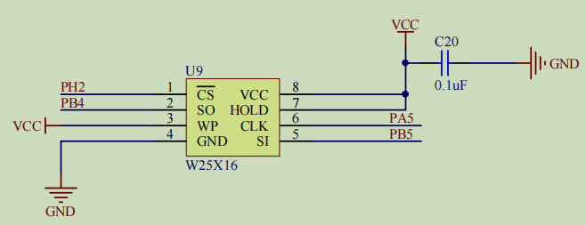
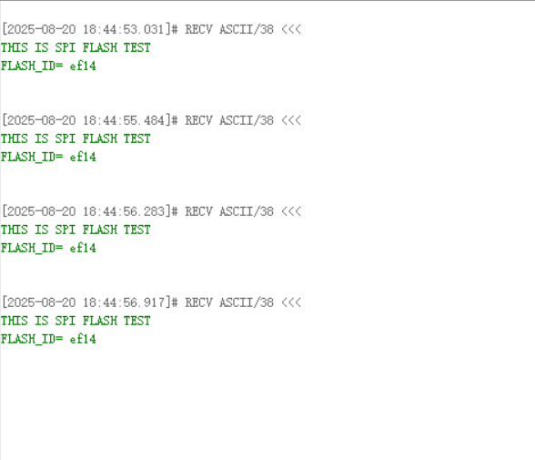

## SPI总线通信原理

**W25X16 这类 SPI-NOR Flash** 只认 **8-bit 帧**，所以和它通信时必须以 **8 位为单位** 发送命令、地址和数据。

NSS: 	起始，结束信号

SCK： 数据同步

MOSI：输出数据

MISO：输入数据

每个时钟周期，传输一位数据，输入输出，同时进行

每次8位或16位 ，数量不受限制

**一次可以并行传输的二进制位数，位数越高，传输效率越高。**

| 位数     | 含义                                                  | 举例                                                    |
| -------- | ----------------------------------------------------- | ------------------------------------------------------- |
| **8位**  | 每次传输可以并行传输 **8个二进制位（1字节）** 的数据  | 早期单片机（如8051）使用8位数据总线                     |
| **16位** | 每次传输可以并行传输 **16个二进制位（2字节）** 的数据 | 较高级别的微控制器（如STM32F103）使用16位或32位数据总线 |

数据寄存器---->**移位**寄存器

完成一次数据传输，读和写都触发

处理器<----->外设

### SPI四种通信方式

#### 时钟极性CPOL ：时钟 空闲时的 电平（SCK引脚）

#### 时钟相位CPHA：数据采样时的时钟沿

CPHA=0	MOSI或MISO**数据线上的信号** 会 在 SCK时钟线的**奇数**边沿被**采样**

CPHA=1																						**偶数**

**如何配置 采样模式 取决于 从设备**

主机和从机同种模式下正常通讯


### SPI控制器特性

通讯引脚

 	根据主机芯片的型号不同，外设挂载的总线不同，时钟速率不同，决定通讯速率不同


时钟控制逻辑

​											BR[0:2]   																				分频	

| 000  |  2   |
| :--: | :--: |
| 001  |  4   |
| 010  |  8   |
| 011  |  16  |


数据控制逻辑

​	写或读都通过	DR可读可写

​	CR1-->DFF位 配置为 8位或16位

​	CR1-->LSBFIRST位	**MSB**(**数据传输高位优先**)先行或LSB先行


整体控制逻辑

​	单双向模式	 双：即接收又发送

​	主从模式

​	状态寄存器SR

实际开发一般使用普通GPIO 软件控制电平输出，产生通讯起止信号


## 串行FLASH_W25X16

FLASH-闪存	U盘、SD卡、SSD固态硬盘  芯片内部-->存储程序

**EEP ROM-->单个字节擦写	FLASH-闪存-->大片擦写**

| 对比维度         | **W25X16 (SPI NOR)**              | **典型 NAND Flash**        |
| ---------------- | --------------------------------- | -------------------------- |
| **存储单元**     | NOR（位可随机寻址）               | NAND（块-页寻址）          |
| **最小读取单位** | **任意字节**                      | **整页**（2 KB/4 KB/8 KB） |
| **最小写入单位** | **1–256 B 页编程**                | **整页**                   |
| **最小擦除单位** | **4 KB 扇区 / 64 KB 块**          | **128 KB ~ 2 MB 块**       |
| **接口**         | SPI（简单，引脚少）               | 并行 8-bit/16-bit 或 ONFI  |
| **随机访问**     | **支持 MCU XIP 执行**             | 不支持直接执行             |
| **典型容量**     | 1 Mb – 256 Mb                     | 1 Gb – 1 Tb                |
| **寿命**         | 10 万次擦写                       | 1 万 ~ 10 万次             |
| **速度**         | 读快（75 MHz）、写慢（页 1.6 ms） | 写快、读慢（需 ECC）       |

**“页”是写入的最小单位，“扇区/块”是擦除的最小单位，大小取决于 FLASH 类型和芯片型号。**

| 引脚编号 | 引脚名 | I/O  | 功能说明                                |
| -------- | ------ | ---- | --------------------------------------- |
| 1        | CS#    | I    | 芯片选择（低电平有效）                  |
| 2        | DO     | O    | 串行数据输出（MISO）                    |
| 3        | /WP    | I    | 写保护（低电平有效），可锁定状态寄存器  |
| 4        | GND    | —    | 地                                      |
| 5        | DI     | I    | 串行数据输入（MOSI）                    |
| 6        | CLK    | I    | 串行时钟输入                            |
| 7        | HOLD#  | I    | 暂停功能（低电平有效），用于中断SPI通信 |
| 8        | VCC    | —    | 电源（2.7V ~ 3.6V）                     |

### W25X16控制指令

**STM32** 利用 **SPI总线** (**协议**) 向 **FLASH芯片** 发送指令

读制造商/设备ID  90H

写使能命令  06H

扇区擦出   20H	只能把1改为0  0不能改为1   擦除即全置1

读状态寄存器 05H  

读数据	03H

写数据 页编程 02H


FLASH模块原理图




读制造商/设备ID 指令 时序图


STM32CubeMXshe设置


w25x16.c	w25x16.h

```c
#include "w25x16.h"

extern SPI_HandleTypeDef hspi1;

/*读写一个字节函数*/
uint8_t sFLASH_SendByte(uint8_t byte)
{
	uint8_t TX_DATA = byte;
	uint8_t RX_DATA = 0;
	
	HAL_SPI_TransmitReceive(&hspi1, &TX_DATA, &RX_DATA, 1, 1000);
	
	return RX_DATA;
}

/*读制造商、设备ID */
uint16_t sFLASH_ReadID(void)
{
	uint16_t FLASH_ID = 0;
	uint8_t temp0 = 0;
	uint8_t temp1 = 0;
	
	//选中
	sFLASH_CS_LOW();
	
	//指令
	sFLASH_SendByte(W25X_ManufactDeviceID);
	
	//地址
	sFLASH_SendByte(sFLASH_DUMMY_BYTE);
	sFLASH_SendByte(sFLASH_DUMMY_BYTE);
	sFLASH_SendByte(sFLASH_DUMMY_BYTE);
	
	//接收
	temp0 = sFLASH_SendByte(sFLASH_DUMMY_BYTE);
	temp1 = sFLASH_SendByte(sFLASH_DUMMY_BYTE);
	
	//释放
	sFLASH_CS_HIGH();
	
	FLASH_ID = temp0 << 8 | temp1;
	
	return FLASH_ID;
}

```

```c
#ifndef __W25X16_H
#define __W25X16_H

#include "stm32f4xx_hal.h"


#define W25X_ManufactDeviceID  0x90  		/* Read identification */
#define sFLASH_CMD_WREN        0x06			/* Write enable instruction */
#define sFLASH_CMD_RDSR        0x05			/* Read Status Register instruction  */
#define sFLASH_CMD_SE          0x20			/* Sector Erase instruction */
#define sFLASH_CMD_WRITE       0x02  		/* Write to Memory instruction */
#define sFLASH_CMD_READ        0x03			/* Read from Memory instruction */	

#define sFLASH_DUMMY_BYTE      0x00
#define sFLASH_BUSY_FLAG        0x01
#define sFLASH_SPI_PAGESIZE       0x100

/* 拉低片选 选中芯片 */
#define sFLASH_CS_LOW()       HAL_GPIO_WritePin(GPIOH,GPIO_PIN_2,GPIO_PIN_RESET)
/* 拉高片选 释放芯片*/
#define sFLASH_CS_HIGH()      HAL_GPIO_WritePin(GPIOH,GPIO_PIN_2,GPIO_PIN_SET)


uint8_t sFLASH_SendByte(uint8_t byte);
uint16_t sFLASH_ReadID(void);
void sFLASH_EraseSector(uint32_t SectorAddr);
void sFLASH_WriteBuffer(uint8_t* pBuffer, uint32_t WriteAddr, uint32_t NumByteToWrite);
void sFLASH_WritePage(uint8_t* pBuffer, uint32_t WriteAddr, uint32_t NumByteToWrite);
void sFLASH_ReadBuffer(uint8_t* pBuffer, uint32_t ReadAddr, uint32_t NumByteToRead);


#endif

```


实验结果




擦除测试

main.c

```c
/**
  ******************************************************************************
  * @file           : main.c
  * @brief          : Main program body
  ******************************************************************************
  ** This notice applies to any and all portions of this file
  * that are not between comment pairs USER CODE BEGIN and
  * USER CODE END. Other portions of this file, whether 
  * inserted by the user or by software development tools
  * are owned by their respective copyright owners.
  *
  * COPYRIGHT(c) 2025 STMicroelectronics
  *
  * Redistribution and use in source and binary forms, with or without modification,
  * are permitted provided that the following conditions are met:
  *   1. Redistributions of source code must retain the above copyright notice,
  *      this list of conditions and the following disclaimer.
  *   2. Redistributions in binary form must reproduce the above copyright notice,
  *      this list of conditions and the following disclaimer in the documentation
  *      and/or other materials provided with the distribution.
  *   3. Neither the name of STMicroelectronics nor the names of its contributors
  *      may be used to endorse or promote products derived from this software
  *      without specific prior written permission.
  *
  * THIS SOFTWARE IS PROVIDED BY THE COPYRIGHT HOLDERS AND CONTRIBUTORS "AS IS"
  * AND ANY EXPRESS OR IMPLIED WARRANTIES, INCLUDING, BUT NOT LIMITED TO, THE
  * IMPLIED WARRANTIES OF MERCHANTABILITY AND FITNESS FOR A PARTICULAR PURPOSE ARE
  * DISCLAIMED. IN NO EVENT SHALL THE COPYRIGHT HOLDER OR CONTRIBUTORS BE LIABLE
  * FOR ANY DIRECT, INDIRECT, INCIDENTAL, SPECIAL, EXEMPLARY, OR CONSEQUENTIAL
  * DAMAGES (INCLUDING, BUT NOT LIMITED TO, PROCUREMENT OF SUBSTITUTE GOODS OR
  * SERVICES; LOSS OF USE, DATA, OR PROFITS; OR BUSINESS INTERRUPTION) HOWEVER
  * CAUSED AND ON ANY THEORY OF LIABILITY, WHETHER IN CONTRACT, STRICT LIABILITY,
  * OR TORT (INCLUDING NEGLIGENCE OR OTHERWISE) ARISING IN ANY WAY OUT OF THE USE
  * OF THIS SOFTWARE, EVEN IF ADVISED OF THE POSSIBILITY OF SUCH DAMAGE.
  *
  ******************************************************************************
  */
/* Includes ------------------------------------------------------------------*/
#include "main.h"
#include "stm32f4xx_hal.h"
#include "spi.h"
#include "usart.h"
#include "gpio.h"

/* USER CODE BEGIN Includes */
#include "w25x16.h"
/* USER CODE END Includes */

/* Private variables ---------------------------------------------------------*/

/* USER CODE BEGIN PV */
/* Private variables ---------------------------------------------------------*/
//大于一个扇区4096byte
uint8_t RD_Buffer[5000] = {0};
/* USER CODE END PV */

/* Private function prototypes -----------------------------------------------*/
void SystemClock_Config(void);

/* USER CODE BEGIN PFP */
/* Private function prototypes -----------------------------------------------*/

/* USER CODE END PFP */

/* USER CODE BEGIN 0 */
int fputc(int ch, FILE *p)
{
	while(!(USART1->SR & (1<<7)));
	
	USART1->DR = ch;
	
	return ch;
}
/* USER CODE END 0 */

/**
  * @brief  The application entry point.
  *
  * @retval None
  */
int main(void)
{
  /* USER CODE BEGIN 1 */
	uint16_t FLASH_ID = 0;
	uint16_t i = 0;
  /* USER CODE END 1 */

  /* MCU Configuration----------------------------------------------------------*/

  /* Reset of all peripherals, Initializes the Flash interface and the Systick. */
  HAL_Init();

  /* USER CODE BEGIN Init */

  /* USER CODE END Init */

  /* Configure the system clock */
  SystemClock_Config();

  /* USER CODE BEGIN SysInit */

  /* USER CODE END SysInit */

  /* Initialize all configured peripherals */
  MX_GPIO_Init();
  MX_SPI1_Init();
  MX_USART1_UART_Init();
  /* USER CODE BEGIN 2 */
	
	printf("THIS IS SPI FLASH TEST\n");
	
	FLASH_ID = sFLASH_ReadID();
	
	printf("FLASH_ID= %x\n",FLASH_ID);
	

	//测试擦除
	sFLASH_EraseSector(4096*0);
	
	//读 所有位 全为1 则擦除成功 从地址0开始读  4096个字节byte 存入RD_Buffer数组
	sFLASH_ReadBuffer(RD_Buffer,0,4096);
	
	
	for(i = 0; i < 4096; i++)
	{
		printf("%x ",RD_Buffer[i]);
		
		if(255 != RD_Buffer[i]) //每个字节8位全为1 一个元素的大小为255(0xff)
		{
			printf("Sector erase failed.\n");
		}
	}
	printf("Sector erase successful.\n");
	
  /* USER CODE END 2 */
	
	
  /* Infinite loop */
  /* USER CODE BEGIN WHILE */
  while (1)
  {

  /* USER CODE END WHILE */

  /* USER CODE BEGIN 3 */

  }
  /* USER CODE END 3 */

}

/**
  * @brief System Clock Configuration
  * @retval None
  */
void SystemClock_Config(void)
{

  RCC_OscInitTypeDef RCC_OscInitStruct;
  RCC_ClkInitTypeDef RCC_ClkInitStruct;

    /**Configure the main internal regulator output voltage 
    */
  __HAL_RCC_PWR_CLK_ENABLE();

  __HAL_PWR_VOLTAGESCALING_CONFIG(PWR_REGULATOR_VOLTAGE_SCALE1);

    /**Initializes the CPU, AHB and APB busses clocks 
    */
  RCC_OscInitStruct.OscillatorType = RCC_OSCILLATORTYPE_HSE;
  RCC_OscInitStruct.HSEState = RCC_HSE_ON;
  RCC_OscInitStruct.PLL.PLLState = RCC_PLL_ON;
  RCC_OscInitStruct.PLL.PLLSource = RCC_PLLSOURCE_HSE;
  RCC_OscInitStruct.PLL.PLLM = 25;
  RCC_OscInitStruct.PLL.PLLN = 336;
  RCC_OscInitStruct.PLL.PLLP = RCC_PLLP_DIV2;
  RCC_OscInitStruct.PLL.PLLQ = 4;
  if (HAL_RCC_OscConfig(&RCC_OscInitStruct) != HAL_OK)
  {
    _Error_Handler(__FILE__, __LINE__);
  }

    /**Initializes the CPU, AHB and APB busses clocks 
    */
  RCC_ClkInitStruct.ClockType = RCC_CLOCKTYPE_HCLK|RCC_CLOCKTYPE_SYSCLK
                              |RCC_CLOCKTYPE_PCLK1|RCC_CLOCKTYPE_PCLK2;
  RCC_ClkInitStruct.SYSCLKSource = RCC_SYSCLKSOURCE_PLLCLK;
  RCC_ClkInitStruct.AHBCLKDivider = RCC_SYSCLK_DIV1;
  RCC_ClkInitStruct.APB1CLKDivider = RCC_HCLK_DIV4;
  RCC_ClkInitStruct.APB2CLKDivider = RCC_HCLK_DIV2;

  if (HAL_RCC_ClockConfig(&RCC_ClkInitStruct, FLASH_LATENCY_5) != HAL_OK)
  {
    _Error_Handler(__FILE__, __LINE__);
  }

    /**Configure the Systick interrupt time 
    */
  HAL_SYSTICK_Config(HAL_RCC_GetHCLKFreq()/1000);

    /**Configure the Systick 
    */
  HAL_SYSTICK_CLKSourceConfig(SYSTICK_CLKSOURCE_HCLK);

  /* SysTick_IRQn interrupt configuration */
  HAL_NVIC_SetPriority(SysTick_IRQn, 0, 0);
}

/* USER CODE BEGIN 4 */

/* USER CODE END 4 */

/**
  * @brief  This function is executed in case of error occurrence.
  * @param  file: The file name as string.
  * @param  line: The line in file as a number.
  * @retval None
  */
void _Error_Handler(char *file, int line)
{
  /* USER CODE BEGIN Error_Handler_Debug */
  /* User can add his own implementation to report the HAL error return state */
  while(1)
  {
  }
  /* USER CODE END Error_Handler_Debug */
}

#ifdef  USE_FULL_ASSERT
/**
  * @brief  Reports the name of the source file and the source line number
  *         where the assert_param error has occurred.
  * @param  file: pointer to the source file name
  * @param  line: assert_param error line source number
  * @retval None
  */
void assert_failed(uint8_t* file, uint32_t line)
{ 
  /* USER CODE BEGIN 6 */
  /* User can add his own implementation to report the file name and line number,
     tex: printf("Wrong parameters value: file %s on line %d\r\n", file, line) */
  /* USER CODE END 6 */
}
#endif /* USE_FULL_ASSERT */

/**
  * @}
  */

/**
  * @}
  */

/************************ (C) COPYRIGHT STMicroelectronics *****END OF FILE****/

```


w25x16.c


```c
#include "w25x16.h"

extern SPI_HandleTypeDef hspi1;

/*ׁдһٶؖޚگ˽*/
uint8_t sFLASH_SendByte(uint8_t byte)
{
	uint8_t TX_DATA = byte;
	uint8_t RX_DATA = 0;
	
	HAL_SPI_TransmitReceive(&hspi1, &TX_DATA, &RX_DATA, 1, 1000);
	
	return RX_DATA;
}

uint16_t sFLASH_ReadID(void)
{
	uint16_t FLASH_ID = 0;
	uint8_t temp0 = 0;
	uint8_t temp1 = 0;
	
	//ѡאоƬ
	sFLASH_CS_LOW();
	
	//Јעָ̍®0x90
	sFLASH_SendByte(W25X_ManufactDeviceID);
	
	//SPIޓࠚһՎֻŜע8λ 24λַ֘ӰΪ3Վ
	sFLASH_SendByte(sFLASH_DUMMY_BYTE);
	sFLASH_SendByte(sFLASH_DUMMY_BYTE);
	sFLASH_SendByte(sFLASH_DUMMY_BYTE);
	
	//ÿՎޓ˕8λ
	temp0 = sFLASH_SendByte(sFLASH_DUMMY_BYTE);
	temp1 = sFLASH_SendByte(sFLASH_DUMMY_BYTE);
	
	//ˍ؅оƬ
	sFLASH_CS_HIGH();
	
	FLASH_ID = temp0 << 8 | temp1;
	
	return FLASH_ID;
}

void sFLASH_WriteEnable(void)
{
	sFLASH_CS_LOW();
	
	sFLASH_SendByte(sFLASH_CMD_WREN);
	
	sFLASH_CS_HIGH();
}

//ֈսӁԽܲдΪԉ
void sFLASH_WaitForEnd(void)
{
	uint8_t sr_value = 0;
	sFLASH_CS_LOW();
	
	//עָ̍®
	sFLASH_SendByte(sFLASH_CMD_RDSR);
	
	do{
		//ע̍ࠕؖػ ܱȡ״ֵ̬
		sr_value = sFLASH_SendByte(sFLASH_DUMMY_BYTE);
	}while(sr_value & sFLASH_BUSY_FLAG);//ֈսӁԽܲдΪԉ
	//sr_value = 1 ղֽ՚æ
	//sr_value = 0 æΪ‹
	
	sFLASH_CS_HIGH();
}

void sFLASH_EraseSector(uint32_t SectorAddr)
{
	sFLASH_WriteEnable();
	
	sFLASH_CS_LOW();
	
	sFLASH_SendByte(sFLASH_CMD_SE);
	
	
	sFLASH_SendByte((SectorAddr >> 16) & 0xff);
	
	sFLASH_SendByte((SectorAddr >> 8) & 0xff);
	
	sFLASH_SendByte((SectorAddr >> 0) & 0xff);
	
	sFLASH_CS_HIGH();
	
	//等待擦除完成
	sFLASH_WaitForEnd();
}

void sFLASH_ReadBuffer(uint8_t* pBuffer, uint32_t ReadAddr, uint32_t NumByteToRead)
{
	sFLASH_CS_LOW();
	//发送读数据指令 0x03 
	sFLASH_SendByte(sFLASH_CMD_READ);
	
	//发送要读的地址，从高到低的地址位
	sFLASH_SendByte((ReadAddr >> 16) & 0xff);
	
	sFLASH_SendByte((ReadAddr >> 8) & 0xff);
	
	sFLASH_SendByte((ReadAddr >> 0) & 0xff);
	
	//循环读
	while(NumByteToRead--) //为0时结束
	{
		//发送空字节 获得连续自增的数据
		*pBuffer = sFLASH_SendByte(sFLASH_DUMMY_BYTE);
		pBuffer++;
	}
		
	
	sFLASH_CS_HIGH();
}


```

